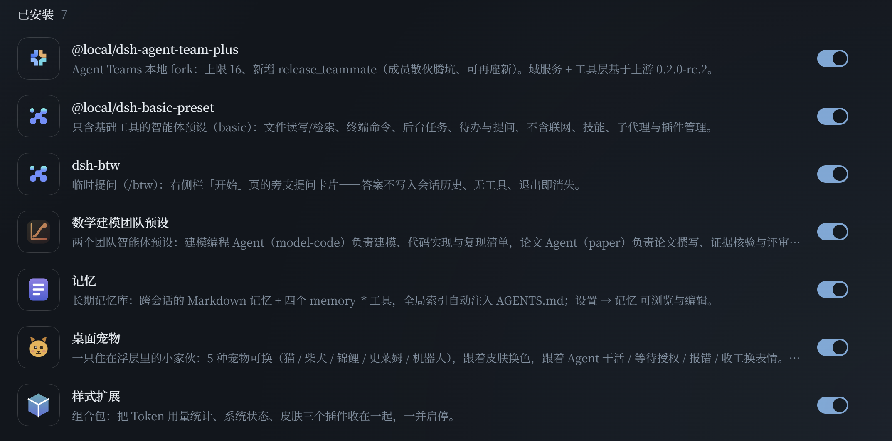

# dsh-plugins —— DeepSeek Harness 自研插件集

[](LICENSE)
[](https://github.com/topics/dsh-plugin)
[](https://github.com/topics/dsh-plugin)

八个跑在 [DeepSeek Harness](https://github.com/topics/dsh-plugin)（DSH）桌面端里的**社区插件包**：
长期记忆、桌面宠物、GUI 皮肤、Token 用量报表、系统状态、旁支提问，以及给官方 Agent Teams
补上「让 teammates 散伙」的 fork。

全是真跑起来的插件——每个包都自带自检脚本，踩过的坑写进了各自的 README。



> 上图是 DSH 侧栏「插件」页的「已安装」列表（本机实机截图，其中两个本地预设包不在本仓库内）。

---

## 插件一览

| 插件 | 包名 / 版本 | 形态 | 一句话 |
| --- | --- | --- | --- |
| [**记忆**](memory/) | `dsh-memory` 0.3.1 | 组合包 | 跨会话的 Markdown 长期记忆 + 四个 `memory_*` 工具，全局索引自动注入 `AGENTS.md`，设置页可浏览编辑 |
| [**桌面宠物**](pet/) | `dsh-pet` 0.1.0 | 组合包 | 浮层里的一只小家伙：5 种宠物、7 种状态，随皮肤换色、随 Agent 干活换表情 |
| [**皮肤**](skins/) | `dsh-skins` 1.0.0 | 普通包 | 叠加在浅/深主题上的 7 套配色层（青花瓷 / 东京夜 / 水墨 / 青绿山水 / 卡布奇诺 / 中国风 / 莫兰迪），字体一起换 |
| [**系统状态**](sysmon/) | `dsh-sysmon` 1.0.0 | 普通包 | 侧栏底部 CPU 圆环 + CPU / 内存 / 磁盘 IO / 双显卡面板 |
| [**Token 统计**](token-stats/) | `dsh-token-stats` 0.1.0 | 普通包 | 解析会话日志 `usage`：活跃度热力图 + 每日趋势 + 模型用量环形图 |
| [**样式扩展**](style-extras/) | `dsh-style-extras` 1.0.0 | 组合包 | 把上面三个（皮肤 / 系统状态 / Token 统计）收进一张卡片统一启停 |
| [**临时提问**](btw/) | `dsh-btw` 0.1.0 | 组合包 | 右侧栏「开始」页的 `/btw` 卡片：答案不进历史、没有工具、退出即消失 |
| [**Agent Teams Plus**](agent-team-plus/) | `@local/dsh-agent-team-plus` 0.2.0-rc.2.1 | 组合包 | 官方 Agent Teams 的 fork：成员上限 8 → 16，新增 `release_teammate`（成员散伙腾坑、可再雇新） |

> 「组合包」= 自带 `dsh.bundle.patch`，在侧栏「插件」页里有独立卡片；「普通包」= 只有加载行，
> 由 profile 的 patch 或某个组合包声明（本仓库里 `skins` / `sysmon` / `token-stats` 由
> `dsh-style-extras` 声明）。

---

## 安装

### 前置

- **DSH 桌面端 ≥ 0.2.0**（0.2.0 起旧 `.agent-presets/` 机制废除，插件走 bundle 声明）。
  各包按 `0.2.0-rc.2` 的宿主契约开发与验证。
- 插件跑在 DSH 自带运行时里，**不需要**系统 Node / pnpm。
- 本仓库**不打包**任何 `@deepseek-ai/*` 依赖，由你本机的 DSH 安装提供。

### 方式 A：让 DSH 自己装（推荐）

把仓库 clone 到任意位置，然后在 DSH 里用 `plugin_manager` 逐个安装：

```powershell
git clone https://github.com/OrinVoss/dsh-plugins.git "$env:USERPROFILE\.dsh\plugins-git"
```

安装 `memory` 这个包（target 用**包目录的绝对路径**）：

```
plugin_manager → install_bundle → target: "C:\Users\<你>\.dsh\plugins-git\memory"
```

`install_bundle` 会**自动写好** profile 的两处声明：`dependencies` 里的 `link:` 与
`dsh.profile.bundles` 里的包名。组合包（memory / pet / style-extras / btw / agent-team-plus）
装完即出现在「插件」页。

⚠️ 装 `style-extras` 时**三个成员包也要 link 进 profile**（它的 patch 只声明加载行，
不提供包本体）：

```
plugin_manager → install_bundle → ...\skins
plugin_manager → install_bundle → ...\sysmon
plugin_manager → install_bundle → ...\token-stats
plugin_manager → install_bundle → ...\style-extras
```

### 方式 B：手工改 profile

编辑 `~/.dsh/profiles/desktop/package.json`：

```json
{
  "dependencies": {
    "dsh-memory": "link:C:/Users/you/.dsh/plugins-git/memory"
  },
  "dsh": {
    "profile": {
      "bundles": ["@deepseek-ai/dsh-base", "@deepseek-ai/dsh-web-app", "dsh-memory"]
    }
  }
}
```

`link:` 只解决「包在哪」，`bundles` 才决定它是否出现在「插件」页。
**别在 profile 自己的 `cordis.patch.yml` 里再 insert 同一个 id**——`applyEntryPatches`
只做 push，同 id 插两次会加载两遍，第二次注册同名工具直接报 `already registered`。

### 装完要重启

- **带客户端半边的插件**（设置页、侧栏面板、浮层、皮肤）：**必须重启桌面端**才生效——
  DSH 桌面端没有「重新加载」菜单，F5 / Ctrl+R 也未接线。
- 纯宿主插件按 HMR 热重载；HMR 只盯入口文件，改了 `lib/` 里的模块要碰一下入口才重挂载。

### 自检

```powershell
cd <包目录>; npm test          # 有 test 脚本的包
```

| 包 | 自检 |
| --- | --- |
| memory | `node selfcheck.cjs` / `plugintest.cjs` / `clienttest.cjs` / `lintmemory.cjs`（`npm test` 依次跑四套） |
| pet | `node selfcheck.cjs` + `node test/hosttest.cjs` |
| btw | `node selftest.cjs` |
| token-stats | `node selftest.cjs`（`--live` 走真实会话日志） |
| style-extras | `node selfcheck.cjs` |
| agent-team-plus | `node test/setup.mjs && node test/run.mjs` |
| skins / sysmon | 视觉验收走 `preview/`（见各包 README） |

---

## 各插件

### 记忆 `dsh-memory`

跨会话的 Markdown 长期记忆库：`~/.dsh/memory` 下是 `INDEX.md` + 分主题目录，模型拿到
`memory_write` / `memory_search` / `memory_read` / `memory_forget` 四个工具；全局索引
由插件维护进 `~/.dsh/AGENTS.md` 的托管区块自动注入。设置 → 记忆 里可浏览 / 编辑 / 删除，
带健康度卡片；落盘即 `git commit`（只本地、从不 push）。

细节与坑（`overwrite` 漏传 `section` 造成索引重复登记等）见 [memory/README.md](memory/README.md)。

### 桌面宠物 `dsh-pet`

浮层里的一只小家伙，5 种宠物（像素猫 / 柴犬 / 锦鲤 / 史莱姆 / 小机器人）+ 7 种状态
（idle / work / wait / done / error / sleep / pat）。宿主半边只读会话事件折成快照，
客户端 1.2 s 轮询：气泡说的是人话（「翻文件…」「派小弟…」，绝不吐工具原名）、
点一下摸头、双击换宠物、按住拖到任意位置、大小 28–200px 可调，颜色跟随皮肤强调色。
预览见 `pet/preview/`。

### 皮肤 `dsh-skins`

把一整套配色以 `--dsw-*` 别名 token 叠加在当前主题上，随「设置 → 通用 → 皮肤」切换。
7 套皮肤 × 浅深两档 = 14 份完整调色板，字体各不相同。实机截图见 `skins/preview/`。

### 系统状态 `dsh-sysmon`

侧栏底部常驻一个 CPU 圆环，点开是本机状态面板：CPU / 内存 / 磁盘 IO / 双显卡占用。
宿主半边注册两个只读路由（`/sysmon-api/sample`、`/sysmon-api/width`），只用 Node 内置模块。

### Token 统计 `dsh-token-stats`

侧栏「Token 统计」页：解析 `$DSH_HOME/sessions/**/*.jsonl.zstd` 里每条
`assistant/message` 的 `usage`，逐帧解压后聚合，落磁盘缓存。含活跃度热力图、
每日趋势图、模型用量环形图，范围可切近 7 日 / 近 30 日 / 全部。

### 临时提问 `dsh-btw`

对齐 Claude Code `/btw` 的旁支提问：右侧栏「开始」页第四张卡片，独立 tab。
回答**不写入会话历史**、**没有工具**、**退出即消失**。不复用会话历史（最近 ~48K 字符
压成纯文本塞进一条 user 消息），所以它不会以为自己是主会话、也不会模仿工具调用；
输入从 ~190k token 降到 ~12k，实测同一问题 2–3 分钟 → **4.5 秒**。

### Agent Teams Plus `@local/dsh-agent-team-plus`

官方 `@deepseek-ai/dsh-experimental-agent-team-profile@0.2.0-rc.2` 的 fork，两处改动：

1. 成员上限 **8 → 16**（patch 里 `config.maxMembers: 16`，官方包本体不动）；
2. 新增 **`release_teammate`** 工具：Lead 让干完活的成员「散伙」——从名册摘除、
   名额与名字立刻可复用（同名可再雇），带 `TEAM_MEMBER_HAS_TASKS` 等稳定错误码门禁。

上游是 MIT 许可的公开包，本仓库保留其版权与许可声明，见
[agent-team-plus/LICENSE](agent-team-plus/LICENSE) 与 [THIRD-PARTY-NOTICES.md](THIRD-PARTY-NOTICES.md)。
改动清单、`release_teammate` 语义、DSH 升级后的重对齐 SOP 见
[agent-team-plus/README.md](agent-team-plus/README.md)。

---

## 仓库结构

```
dsh-plugins/
├── memory/              dsh-memory         组合包：长期记忆 + 4 个工具 + 设置页
├── pet/                 dsh-pet            组合包：桌面宠物浮层
├── skins/               dsh-skins          普通包：7 套皮肤 token 层
├── sysmon/              dsh-sysmon         普通包：侧栏 CPU 圆环 + 状态面板
├── token-stats/         dsh-token-stats    普通包：Token 用量报表
├── btw/                 dsh-btw            组合包：/btw 旁支提问卡片
├── style-extras/        dsh-style-extras   组合包：把 skins/sysmon/token-stats 收成一张卡片
├── agent-team-plus/     官方 Agent Teams 的 fork（上限 16 + release_teammate）
├── tools/               不属于任何插件包的本机维护脚本
├── docs/                README 用的截图
├── LICENSE / THIRD-PARTY-NOTICES.md
└── .gitignore / .gitattributes
```

每个包目录都是**自包含**的：`package.json`（有 `exports` 时必须放开 `./locale/*.json`）、
`icon.svg`、`locale/{zh,en}.json`、宿主半边与客户端半边、以及自己的 README 与自检脚本。

### `tools/`

不属于任何插件包的维护脚本，**不参与插件加载**（不进 `dsh.profile.bundles`、不进 HMR root）：

- `tools/readasar.cjs` —— 从 `F:\dsh\resources\app.asar` 里读文件（`list` / `cat` / `dump` / `grep`）。
  DSH 桌面端的前端产物与设计系统 token 都在 asar 里、仓库里没有源码；核对「官方到底用什么值」
  （如 `--dsw-radius-md` 是 8 还是 12）时用它。asar 头是**两层 pickle**，
  `数据区 = 8 + headerSize`（照常见示例把 `readUInt32LE(4)` 当 jsonLen 会解析失败）。

---

## 开发约定

- 行尾统一 **LF**：仓库级 `core.autocrlf=false` + `.gitattributes` 的 `* text=auto eol=lf`
  （系统级 `core.autocrlf=true` 会把库内 LF 改写成 CRLF）。
- 中文路径没问题：`core.quotepath=false`。
- 改完跑对应包的自检；每次改动都提交，commit message 写清「改了什么 + 验证结果」。
- 视觉 / 前端改动优先看实机截图（无头渲染与真机有差异）。

---

## 许可证

本仓库原创部分：**MIT**（见 [LICENSE](LICENSE)）。
`agent-team-plus/` 基于 DeepSeek 官方 MIT 包修改，保留上游声明（见
[agent-team-plus/LICENSE](agent-team-plus/LICENSE)、[THIRD-PARTY-NOTICES.md](THIRD-PARTY-NOTICES.md)）。

---

## English

**dsh-plugins** is a collection of community plugins for **DeepSeek Harness (DSH)**, a
desktop AI-agent workbench. Eight self-contained packages, each with its own README,
self-check scripts and hard-won gotchas:

`dsh-memory` (cross-session Markdown long-term memory + four tools) ·
`dsh-pet` (desktop pet overlay, 5 pets × 7 states) ·
`dsh-skins` (7 colour skins layered over the built-in light/dark themes) ·
`dsh-sysmon` (CPU ring + system panel) ·
`dsh-token-stats` (token usage heatmap / trend / model donut) ·
`dsh-style-extras` (bundle card for skins + sysmon + token-stats) ·
`dsh-btw` (side-question card; answers never enter the transcript, no tools) ·
`dsh-agent-team-plus` (fork of the official Agent Teams with a member cap of 16 and a
`release_teammate` tool).

Install any package with `plugin_manager → install_bundle` pointing at its absolute
directory, then **restart the desktop app** for client-side plugins. Requires DSH ≥ 0.2.0.
Licensed MIT; `agent-team-plus` retains DeepSeek's upstream MIT notice.

---

## 相关

- DSH 插件生态总入口：<https://github.com/topics/dsh-plugin>
- 姊妹仓库（数学建模团队预设包）：<https://github.com/OrinVoss/dsh-math-team>
